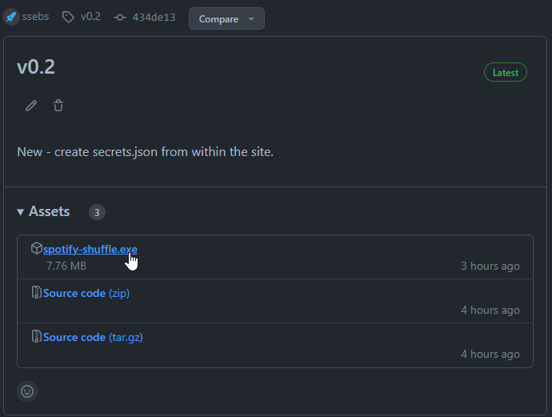
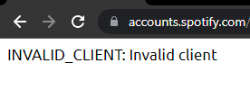

# Spotify-real-shuffle

We all know how bad Spotify's shuffle is, so this tool will shuffle up your custom order for your playlists.

## Prereqs
- Setup your Spotify Developer account (you'll need a regular Spotify account)
    - Go to https://developer.spotify.com/dashboard/
    - Click **Log in**, and log in with your regular Spotify account
    - Click **CREATE AN APP**
        - Enter something for the name and description, it can be whatever you want
        - Click **Create**
    - Copy the **Client ID**, you'll need this later
    - Click **SHOW CLIENT SECRET**
    - Copy the **Client Secret**, you'll need this later
    - Click **Edit Settings** in green
        - Under **Redirect URIs**, paste: `http://127.0.0.1:8080/callback`
        - Save
### Prereqs - running from source
- Clone this repo or download the zip
    - Clone:
        - `$ git clone https://github.com/ssebs/spotify-real-shuffle`
    - Zip:
        - Go to https://github.com/ssebs/spotify-real-shuffle
        - Click the green Code button > Download ZIP

## Installation
- Binary download (EZ install):
    - Download the latest `spotify-shuffle.exe` from [binary release](https://github.com/ssebs/spotify-real-shuffle/releases/)
        - 
    - Allow your browser to download the file, then run `spotify-shuffle.exe`
    - Follow the instructions on the web page
    - Once done, close the terminal that popped up
- Install from source:
    - Install python if not already installed 
    - Linux/Mac
        - `$ python -m venv venv`
        - `$ source ./venv/bin/activate` 
        - `(venv) $ pip install -r requirements.txt`
    - Windows
        - `PS> python.exe -m venv venv`
        - `PS> .\venv\Scripts\Activate.ps1`
            > If you get an execution policy warning, open PowerShell as an administrator and run `Set-ExecutionPolicy RemoteSigned`
        - `(venv) PS> pip install -r requirements.txt`

## Usage
- Binary:
    - Double click the exe 
    - A web browser should open up to http://127.0.0.1:8080
    - Enter the `client_id` and `cliend_secret` that you copied earlier into the text fields
        - They should look like a bunch of numbers and letters (e.g. `29658b9474ac93114a41b84640307830403dasd`)
    - Click Submit
        > If you get a white page that says `INVALID_CLIENT: Invalid client`, then the `client_id` or `cliend_secret` you entered was wrong.
        
        
    - Login to Spotify
    - Allow the app
    - Your playlists should be listed below
        - Check the playlist that you'd like to shuffle
        - Click Submit
        - Wait
        > If you get an error message, it may be that you've selected a playlist that you don't own. Uncheck that playlist.
- From Source:
    - After setting up the environment as detailed above
    - `(venv) $ python spotify-shuffle.py`
    - A web browser should open up to http://127.0.0.1:8080
    - Enter the `client_id` and `cliend_secret` that you copied earlier into the text fields
        - They should look like a bunch of numbers and letters (e.g. `29658b9474ac93114a41b84640307830403dasd`)
    - Click Submit
        > If you get a white page that says `INVALID_CLIENT: Invalid client`, then the `client_id` or `cliend_secret` you entered was wrong.
        
        
    - Login to Spotify
    - Allow the app
    - Your playlists should be listed below
        - Check the playlist that you'd like to shuffle
        - Click Submit
        - Wait
        > If you get an error message, it may be that you've selected a playlist that you don't own. Uncheck that playlist.

## Distributing
To build the .exe:
- `pyinstaller -c -F --add-data "templates;templates" --add-data "static;static" spotify-shuffle.py`
    - Built file is under `./dist/`

## Goals
- [x] Connect to API and read playlist info
- [X] Re-arrange some songs
- [X] Shuffle a playlist and save it
- [x] Support Pagination (max 100 by default)
- [x] User can select which playlists to shuffle
- [ ] User can easily run this
- [x] Support playlists over 100 items (update func)
- [ ] Cleanup
- [x] Generate secrets.json on `/setup`
- [ ] Add error handling for incorrect secrets
    - Not possible, find a good way to present this to users
- [ ] Good error handling

## LICENSE
[GPL V3](./LICENSE)
